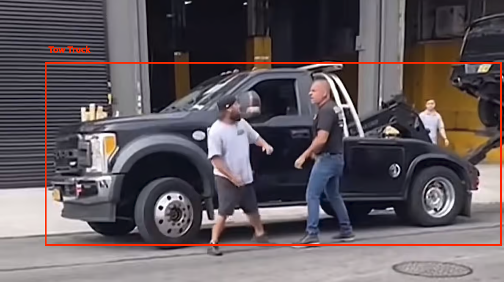

<p align="center">
<br><br><br>
<a href="https://github.com/Haste171/tow-truck-object-detection">
    
    </a>
<br><br><br>
</p>


<p align="center">
<b> Object detection tools to detect tow trucks</b>
</p>

<p align=center>
<a href="https://universe.roboflow.com/david-xtmfo/tow-truck-object-detection">
<a href="https://gitHub.com/Haste171/langchain-chatbot/graphs/commit-activity">
<a href="https://github.com/Haste171/tow-truck-object-detection/blob/master/LICENSE">
<a href="https://discord.gg/KgmN4FPxxT"></a>

</a>


## User-Setup
Join the [Discord](https://discord.gg/KgmN4FPxxT) server for help

## Dev-Setup
Prerequisites:
- [Git](https://git-scm.com/downloads) - Free

### Setup
```
git clone https://github.com/Haste171/tow-truck-object-detection.git
```

### Install Requirements

```python
poetry install
```

### Activate Environment
```python
poetry shell
```

### Setup ClearML for Logging
```python
clearml-init
```

### Access ClearML

Go to https://app.clear.ml/projects to access the project created once training starts to view logs etc.

# Usage

## Training
```python
python main.py train --dataset /path/to/dataset --model_size medium --name TowTruckModel --clear_ml_name TowTruckObjectDetection --patience 10
```

## Inference
```python
python main.py infer --image /path/to/image.jpg
```